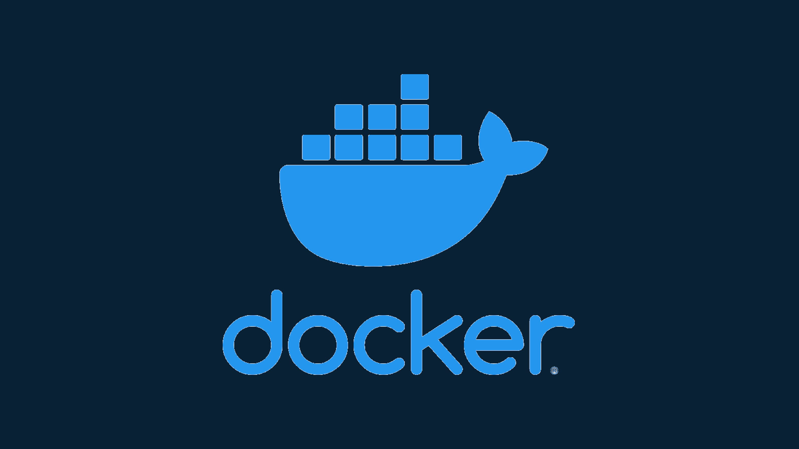
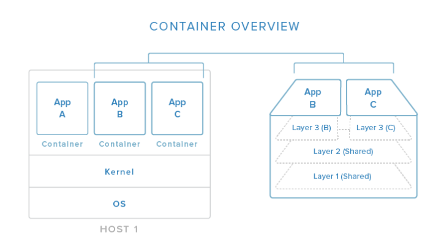
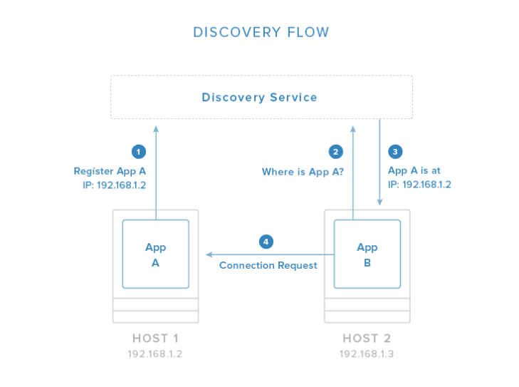
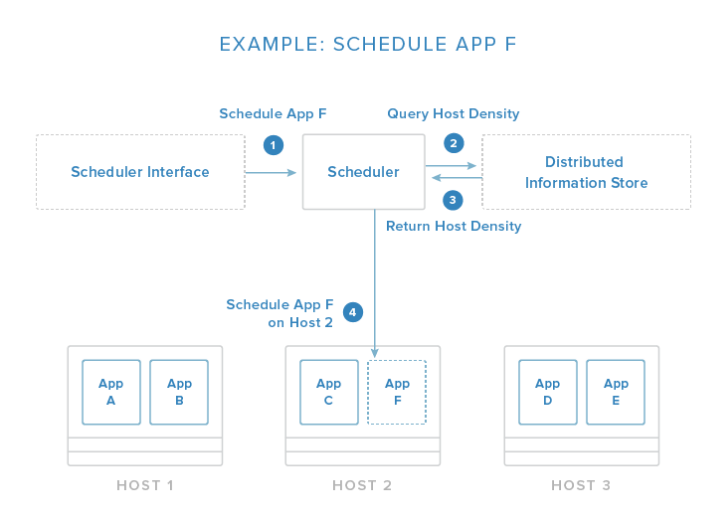

# Docker
---

## Introduction
Docker simplifies the process of managing application processes in distributed environments. It accomplishes this by packaging components and their dependencies into standardized, isolated, lightweight process environments called containers. They're similar to virtual machines, but more portable, resource-friendly, and less dependent on the host operating system. 

In this above image, we can see how containers relate to the host system. Containers isolate individual applications and use operating system resources that have been abstracted by Docker. In the exploded view on the right, we can see that containers can be built by "layering", with multiple containers sharing underlying layers, decreasing resource usage. 

- **Lightweight resource utilization**: instead of virtualizing an entire operating system, containers isolate at the process level and use the host's kernel
- **Portability**: all of the dependencies are bundled inside the container
- **Predictability**: The interfaces are standardized and the interactions are predictable

--- 

### Service Discovery 
Service discovery is one component of an overall strategy aimed at making container deployments scalable and flexible. It helps containers find out about the environment they have been introduced to without administrator intervention. They can find connection information for the components, and register themselves so other tools know they are available. These tools typically function as globally distributed configuration stores where arbitrary config settings can be set for the services operating in your infrastructure. 

Service discovery tools are often implemented as simple key-value stores distributed among its hosts in a clustered environment. They provide an HTTP API for accessing and setting values. Som include additional security measures like encrypted entries or access control mechanisms. They are essential for managing the clustered Docker hosts, as well as providing self-configuration details for new containers. 

Responsibilities include
- Allowing applications to obtain data needed to connect with services they depend on
- Allowing services to register their connection information
- Providing a globally accessible location to store arbitrary configuration data

Popular service discovery tools and related projects:
- [etcd](https://www.digitalocean.com/community/tutorials/how-to-use-etcdctl-and-etcd-coreos-s-distributed-key-value-store): service discovery / globally distributed key-value store
- [consul](https://www.digitalocean.com/community/tutorials/an-introduction-to-using-consul-a-service-discovery-system-on-ubuntu-14-04): service discovery / globally distributed key-value store
- [zookeeper](https://www.digitalocean.com/community/tutorials/an-introduction-to-mesosphere#a-basic-overview-of-apache-mesos): service discovery / globally distributed key-value store
- [crypt](http://xordataexchange.github.io/crypt/): project to encrypt etcd entries
- [confd](https://www.digitalocean.com/community/tutorials/how-to-use-confd-and-etcd-to-dynamically-reconfigure-services-in-coreos): watches k-v store for changes and triggers reconfiguration of services with new values

To learn more about service discovery with Docker, click [here](https://www.digitalocean.com/community/tutorials/the-docker-ecosystem-service-discovery-and-distributed-configuration-stores)

---

### Networking Tools

Docker provides the basic networking structures necessary for container-to-container and container-to-host communication. Their native networking capabilities provide two mechanisms for hooking containers together. The first is to expose a container's ports and optionally map to the host system for external routing. You can select the host port to map to or allow Docker to randomly choose a high, unused port. This is a generic way of providing access to a container that works well for most purposes. 

The other *deprecated* method is to allow containers to communicate by using Docker "links". A linked container will get connection information about its counterpart. Since this is a deprecated feature, we won't cover more on this.

The basic level of networking is suitable for single-host or closely managed environments. However, the Docker ecosystem has produced a variety of projects that focus on additional networking capabilities:
- Overlay networking to simplify and unify the address space across multiple hosts
- VPNs adapted to provide secure communication between various components
- Assigning per-host or per-application subnetting
- Configuring custom MAC addresses, gateways, etc for your containers

Popular networking tools and related projects:
- [flannel](https://github.com/flannel-io/flannel): Overlay network providing each host with a separate subnet
- [weave](https://www.weave.works/docs/net/latest/overview/): Overlay network portraying all containers on a single network

For a more in-depth look at the different approaches to networking with Docker, click [here](https://www.digitalocean.com/community/tutorials/the-docker-ecosystem-networking-and-communication)

---

### Scheduling, Cluster Management, and Orchestration

The image above demonstrates a simplified scheduling decision. The request is given through an API or management tool. From here, the scheduler evaluates the conditions of the request and the state of the available hosts. In this example, it pulls information about container density from a distributed data store / discovery service so that it can place the new application on the least busy host. 

This host selection process is one of the core responsibilities of the scheduler. Usually, it has functions that automate the process with the administrator having the option to specify certain constraints. These might include:
- Schedule the container on the same host as another given container
- Make sure that the container is not placed on the same host as another given container
- Place the container on the least busy host
- Run the container on every host in the cluster

The scheduler is responsible for loading containers onto relevant hosts and starting, stopping, managing the life cycle of the process. Cluster management functions are also typically included; this allows the scheduler to get information about the members and perform adminitration tasks. Orchestration in this context refers to the combination of container scheduling and managing hosts.

Popular scheduling / fleet management tools include:
- [fleet](https://www.digitalocean.com/community/tutorials/how-to-use-fleet-and-fleetctl-to-manage-your-coreos-cluster): scheduler and cluster management tool
- [marathon](https://www.digitalocean.com/community/tutorials/an-introduction-to-mesosphere#a-basic-overview-of-marathon): scheduler and cluster management tool
- [swarm](https://github.com/docker/swarm/): scheduler and cluster management tool
- [mesos](https://www.digitalocean.com/community/tutorials/an-introduction-to-mesosphere#a-basic-overview-of-apache-mesos): host abstraction service that consolidates host resources for the scheduler
- [kubernetes](https://www.digitalocean.com/community/tutorials/an-introduction-to-kubernetes): advanced scheduler capable of managing container groups
- [compose](https://github.com/docker/docker/issues/9694): container orchestration tool for creating container groups

To find out more about basic scheduling, container grouping and cluster management software for Docker, click [here](https://www.digitalocean.com/community/tutorials/the-docker-ecosystem-scheduling-and-orchestration)

---

---

## Acknowledgements

#### - [The Docker Ecosystem: An Introduction to Common Components](https://www.digitalocean.com/community/tutorials/the-docker-ecosystem-an-introduction-to-common-components)