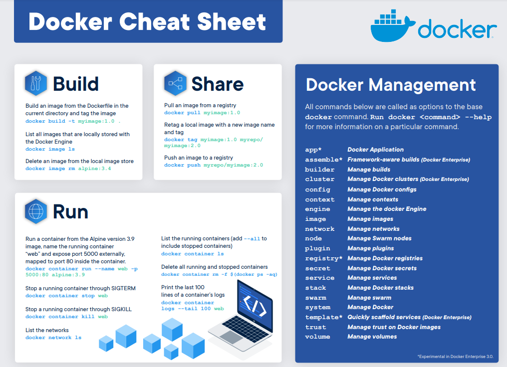

# Tutorial

---



Reference: https://www.docker.com/sites/default/files/d8/2019-09/docker-cheat-sheet.pdf

For a more complete cheatsheet, take a look at dockerlabs' compilation of everything you need to know [here](https://dockerlabs.collabnix.com/docker/cheatsheet/)

<br>

After installing Docker on your local machine, you might want to try it out with the following tutorial commands to get a basic familiarity on the tool.

Open up your favourite Command Line Interface (CLI) and let's get started.


## 1. Using the Docker Command
Using `docker` consists of passing it a chain of options and commands followed by arguments. The systax takes the form:
> docker [option] [command] [arguments]

To view all available subcommands, type:
```bash 
docker
```

To view the options available to a specific command, type:
```bash
docker docker-subcommand --help
```

## 2. Working with Docker images
Docker containers are built from Docker images. By default, Docker pulls these images from [Docker Hub](https://hub.docker.com/), a Docker registry managed by Docker. Anyone can host their Docker images on Docker Hub, so most applications and Linux distributions you'll need will have images hosted there. 

To check whether you can access and run images from Docker Hub, type:
```bash
docker run hello-world
```

Docker was initially unable to find the `hello-world` image locally, so it downloaded the image from Docker Hub. Once downloaded, Docker created a container from the image and the application within the container executed, displaying the message.

You can search for images available on Docker Hub by using the `docker` command with the `search` subcommand.
```bash
docker search ubuntu
```

The script will crawl Docker Hub and return a listing of all images whose name match the search string. 