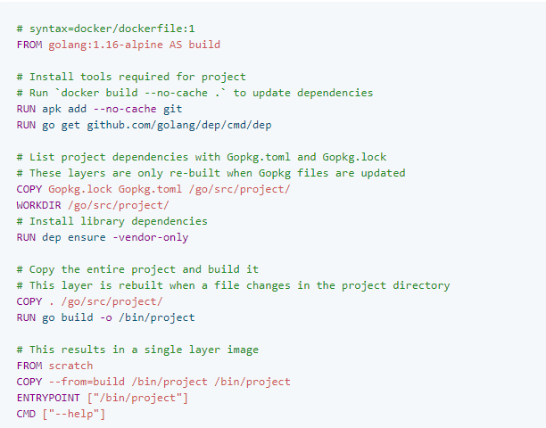

# Docker Best Practices

---

For a detailed compilation of Docker best practices, check sysdig's take [here](https://sysdig.com/blog/dockerfile-best-practices/)


## Dockerfile

Docker builds images automatically by reading the instructions from a `Dockerfile` -- a text file that contains all commands, in order, needed to build a given image. A `Dockerfile` adheres to a specific format and set of instructions which you can find at [Dockerfile reference](https://docs.docker.com/engine/reference/builder/)

A Docker image consists of read-only layers each of which represents a Dockerfile instruction. Layers are stacked and each one is a delta of the changes from the previous layer. 

---

## 1. Avoid unnecessary privileges

### 1.1 Rootless containers
A recent report highlighted that 58% of images are running the container entrypoint as **root (UID 0)**. 
- Make sure the user specified in the USER instruction exists inside the container
- Provide appropriate file system permissions in the locations where the process will be reading or writing.

```docker
FROM alpine:3.12
RUN adduser -D myuser && chown -R myuser /myapp-data
USER myuser
ENTRYPOINT ["/myapp"]
```
### 1.2 Make executables owned by root and not writable
This will block the executing user from modifying existing binaries or scripts. By following this best practice, you're effectively enforcing container immutability. 

The *app* user only needs execution permissions on the file, **not ownership**.

## 2. Reduce attack surface
It is a Dockerfile best practice to **keep the images minimal**.

Avoid including unnecessary packages or exposing ports to reduce the attack surface. The most components you include, the most exposed your system will be and the harder it is to maintain. 

### 2.1 Multi-stage builds
[Multi-stage builds](https://docs.docker.com/develop/develop-images/multistage-build/) allow you to drastically reduce the size of your final image, without struggling to reduce the number of itermediate layers and files. 

By leveraging build cache, you may order layers from the less frequently changed to the more frequently changed:
- Install tools you need to build your application
- Install or update library dependencies
- Generate your application

Example for a Go application could look like:


### 2.2 Use trusted base images
Building on top of untrusted or unmaintained images will inherit all of the problems and vulnerabilities from that image into your containers.

- Prefer *verified* and *official* images from trusted repositories
- Sometimes the *official* images might not be the **better fit**, in regards to security and minimalism. For example, the [bitnami/node](https://hub.docker.com/r/bitnami/node/) image offers customized versions on top of a minideb distribution as compared to the [official node image](https://hub.docker.com/_/node)


### 2.3 Update your images frequently 
Define a versioning strategy
- **Stick to stable** or long-term support versions, which delivery security fixes soon and often
- **Plan in advance**: be ready to drop old versions and migrate before your base image version reaches end of life support
- **Rebuild your own images periodically** with a similar strategy to get the latest packages from the base images. 

### 2.4 Exposed ports
Expose only the ports that your application needs and avoid exposting ports like SSH (22). You may run `docker run --publish-all` to expose all ports for connections, if you're confident with the `EXPOSE` commands in Dockerfile.

<br>

---

## 3 Prevent confidential data leaks

<br>

### 3.1 Credentials and confidentiality
Never hard code any secret or credentials in the Dockerfile instructions (environment variables, args)

- If the application supports **configuration via environment variables**, use them to set secrets on execution (-e option in `docker run`) or use [Docker secrets](https://docs.docker.com/engine/swarm/secrets/), [Kubernetes secrets](https://kubernetes.io/docs/concepts/configuration/secret/) to provide values as environment variables.
- **Use configuration files** and bind mount the configuration files in docker, or mount them from a Kubernetes secret

Also, **your images shouldn't container configuration values** that tie them to some specific environment (production, staging, etc). Instead, allow the image to be customized by **injecting the values on runtime**.

<br>

### 3.2. Understand build context
When you issue a `docker build` command, the current working directory is the *build context*. By default, the Dockerfile is assumed to be located here, but you can specify a different location with the file flag ( -f ). 

```bash
docker build --no-cache -t helloapp:v2 -f dockerfiles/Dockerfile build-context
```

By intentionally specifying the build context, we exclude unnecessary files and result in a smaller and more streamlined image size. This will decrease the time to build the image, time to pull and push it, and the container runtime size. 

<br>

### 3.3. Exclude with .dockerignore
To exclude files not relevant to the build, use a .dockerignore file. The file supports exclusion patterns similar to .gitignore files.

<br>

---

## 4. Others

<br>

### 4.1 Don't install unnecessary packages
To reduce complexity, dependencies, file sizes, and build times, avoid installing extra or unnecessary packages. 

<br>

### 4.2 Decouple applications
Each container should have only one concern. Decoupling applications into multiple containers makes it easier to scale horizontally and reuse containers. 

<br>

### 4.3 Linting
Tools like [Haskell Dockerfile Linter (hadolinter)](https://github.com/hadolint/hadolint) detect bad practices in your Dockerfile and even expose issues inside the shell commands executed by the `RUN` instruction. 

Consider incorporating such a tool in your CI pipelines.

<br>

---

## 5. Beyond image building

### 5.1 Sign images and verify signatures
It is one of Dockerfile best practices to use [docker content trust](https://docs.docker.com/engine/security/trust/)., Docker notary, Harbor notary, or similar tools to **digitally sign your images** and then **verify them on runtime**. 

<br>

### 5.2 Include health / liveness checks
When using plain Docker or Docker Swarm, [include a HEALTHCHECK instruction](https://docs.docker.com/engine/reference/builder/#healthcheck) in your Dockerfile whenever possible. This is critical for long running or persistent services in order to ensure they're healthy, and manage restarting the service otherwise. 

If running your images in Kubernetes, [use livenessProbe configuration](https://kubernetes.io/docs/tasks/configure-pod-container/configure-liveness-readiness-startup-probes/) inside the container definitions, as the docker HEALTHCHECK instruction wont be applied. 


<br>

### FROM
Whenever possible, use current official images as the basis for your images. Alpine image is recommended as it is tightly controlled and small in size (currently under 6 MB), while still being a full Linux distribution.

### LABEL
Add labels (metadata) to your image to help organizes images by project, record licensing information. 

#### apt-get
Always combine `RUN apt-get update` with `apt-get install` in the same `RUN` statement
```docker
RUN apt-get update && apt-get install -y \
    package-bar \
    package-baz \ 
    && rm -rf /var/lib/apt/lists/*
```

Using `apt-get update` alone in a `RUN` statement causes caching issues and subsequent `install` instructions to fail. After building an image once, if `apt-get install` is modified by adding extra package, Docker sees the initial and modified instructions as identical and reuses the cache from previous steps. As a result the `apt-get update` is not executed because the build uses the cached version. 


---

## Acknowledgements
- [Dockerfile best practices - Docker](https://docs.docker.com/develop/develop-images/dockerfile_best-practices/)
- [Dodkcerfile best practices - sysdig](https://sysdig.com/blog/dockerfile-best-practices/)