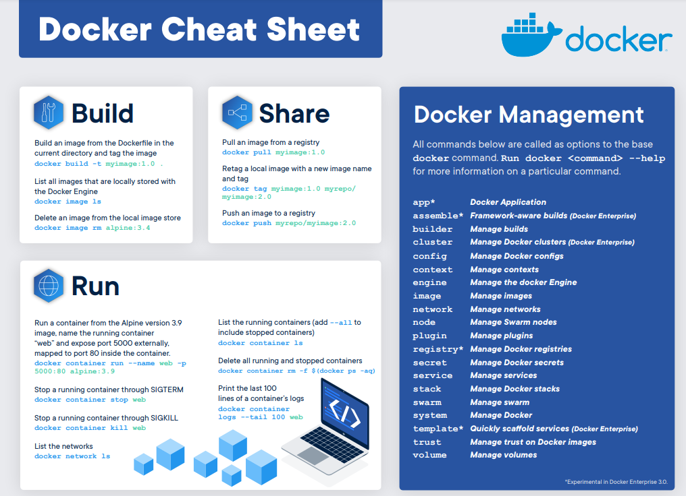

# Basic cheatsheet provided by Docker

[Sourced from Docker](https://www.docker.com/sites/default/files/d8/2019-09/docker-cheat-sheet.pdf)

<br>

For an in-depth cheatsheet, check out [Collabnix's cheatsheet](https://dockerlabs.collabnix.com/docker/cheatsheet/)!

<br><br>

# Useful Docker Commands

## **1. Managing images**

<br>

### <ins>1.1 Build an image</ins>
```bash
docker build -t [USER/]IMAGE_NAME[:TAG] DOCKERFILE
```

### <ins>1.2 Pull images from DockerHub</ins>
```bash
docker pull [USER/]IMAGE_NAME[:TAG]
```

### <ins>1.3 Push images to DockerHub</ins>
```bash
docker push [USER/]IMAGE_NAME[:TAG]
```

### <ins>1.4 Create new image of an edited local container</ins>
```bash
docker commit CONTAINER_ID [USER/]IMAGE_NAME[:TAG]
```

### <ins>1.5 Create a target image referring to a source image</ins>
```bash
docker tag SOURCE_IMAGE[:TAG] [USER/]TARGET_IMAGE[:TAG]
```

### <ins>1.6 View image's intermediate images with sizes and creation details</ins>
```bash
docker history IMAGE_NAME
```

<br><br>

---

## **2. Container lifecycle**

<br>

### <ins>2.1 Start a Docker container</ins>
```bash
docker run -d --name=CONTAINER_NAME -p HOST_PORT:CONTAINER_PORT --rm IMAGE_NAME
```

### <ins>2.2 Show all containers</ins>
```bash
docker ps -a
```

### <ins>2.3 Stop a Docker container</ins>
```bash
docker stop CONTAINER_NAME
```

### <ins>2.4 Restart a Docker container</ins>
```bash
docker restart CONTAINER_NAME
```

### <ins>2.5 Kill all running containers</ins>
```bash
docker container kill $(docker ps -q)
```

### <ins>2.6 Delete all running containers</ins>
```bash
docker container rm $(docker ps -a -q)
```

<br><br>

---
## **3. Managing Containers**

<br>

### <ins>3.1 Start shell within running container</ins>
```bash
docker exec -it CONTAINER_ID /bin/bash
```
### <ins>3.2 Inspect a container</ins>
```bash
docker container inspect CONTAINER_NAME
```

### <ins>3.3 Print a container's logs</ins>
```bash
docker logs CONTAINER_NAME
```

### <ins>3.4 Copying file from container to host</ins>
```
docker cp 02cb2feb2afc:/usr/local/apache2/logs/httpd.pid /home/awazanak/
```

<br><br>

---
## **4. Managing Docker**

<br>

### <ins>4.1 View Docker system info</ins>
```bash
docker info
```

### <ins>4.2 View Docker resource usage</ins>
```bash
docker system df
```

### <ins>4.3 View Docker networks</ins>
```bash
docker network ls
```


<br><br>

---

# Acknowledgements

- [Top 15 Docker Commands - edureka](https://www.edureka.co/blog/docker-commands/)
- [15 Docker commands you should know - towardsdatascience](https://towardsdatascience.com/15-docker-commands-you-should-know-970ea5203421)
- [Docker commands - geekflare](https://geekflare.com/docker-commands/)