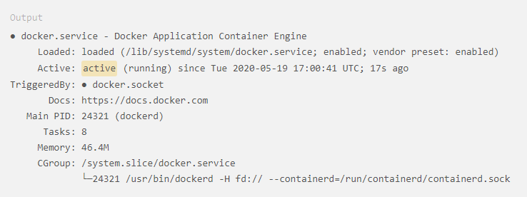

# Docker Set-up


---

## **Ubuntu**

The following setup instructions assume the user is running the following version of Ubuntu:
- **Ubuntu 20.04**


### Step 1 - Installing Docker
The Docker installation package available in the official Ubuntu repository may not be the latest version. To ensure we get the latest version, we'll install Docker from the official Docker repository. To do that, we'll add a new package source, add the GPG key from Docker to ensure the downloads are valid, then install the package

First, update your existing list of packages:
```bash
sudo apt update
```
Next, install a few prerequisite packages which let `apt` use packages over HTTPS:
```bash
sudo apt install apt-transport-https ca-certificates curl software-properties-common
```

Then add the GPG key for the official Docker repository to your system:
```bash
curl -fsSL https://download.docker.com/linux/ubuntu/gpg | sudo apt-key add -
```

Add the Docker repository to APT sources:
```bash
sudo add-apt-repository "deb [arch=amd64] https://download.docker.com/linux/ubuntu focal stable"
```

This will also update our package database with the Docker packages from the newly added repo.
Make sure you are about to install from the Docker repo instead of the default Ubuntu repo
```bash
apt-cache policy docker-ce
```

Finally, install Docker:
```bash
sudo apt install docker-ce
```

Docker should now be installed, the daemon started, and the process enabled to start on boot. Check that its running:
```bash
sudo systemctl status docker
```
The output should be similar to this:


Installing Docker now gives you not just the dockerd daemon service, but also the `docker` command line utility.

<br><br>

### Step 2 - Executing the Docker command without `sudo`
By default, the `docker` command can only be run by the **root** user or by a user in the **docker** group, which is automatically created during Docker's installation process. 

Add your user to the `docker` group
```bash
sudo usermod -aG docker ${USER}
```

To apply the new group membership:
```bash
su - ${USER}
```

Confirm that your user is added to the `docker` group
```bash
groups
```

<br><br>

---

## **Fedora**

The following setup instructions assume the user is running the following version of Fedora:
- **Fedora 35/34/33/32/31/30**

### Step 1 - Update your system

We'll start out by updating and upgrading OS packages:
```bash
sudo dnf -y update
```

It is recommended to reboot your system after an upgrade
```bash 
sudo reboot
```
<br><br>

### Step 2 - Add the `docker` CE repository

```bash
sudo dnf -y install dnf-plugins-core
```

Following command will differ based on Fedora version 
> REPLACE version at ${VERSION}
```bash
sudo tee /etc/yum.repos.d/docker-ce.repo<<EOF
[docker-ce-stable]
name=Docker CE Stable - \$basearch
baseurl=https://download.docker.com/linux/fedora/${VERSION}/\$basearch/stable
enabled=1
gpgcheck=1
gpgkey=https://download.docker.com/linux/fedora/gpg
EOF
```

<br><br>

### Step 3 - Install Docker CE

```bash
sudo dnf makecache
sudo dnf install docker-ce docker-ce-cli containerd.io
```
**Accept** the installation. Then, **accept** to import GPG key with *y* prompt

Docker will be installed but not started. To start the docker service:
```bash
sudo systemctl enable --now docker

systemctl status docker
```

The `docker` group is created, but no users are added to the group. Add your user to the group to run docker commands without sudo
```bash
sudo usermod -aG docker $(whoami)
```

<br>

---
## **Windows**


### Pre-requisites
- WSL 2 Backend: install [here](https://docs.microsoft.com/en-us/windows/wsl/install)
- Linux kernel update package: install [here](https://docs.microsoft.com/en-gb/windows/wsl/install-manual#step-4---download-the-linux-kernel-update-package)

Windows Subsystem for Linux (WSL) 2 introduces a significant architectural change as it is a full Linux kernel built by Microsoft, allowing Linux containers to run natively without emulation. With Docker Desktop running on WSL2, users are leverage Linux workspaces and avoid having to maintain both Linux and Windows build scripts. WSL2 provides improvements to file system sharing, boot time, and allows access to some cool new features. 

### Installation
Follow the guide by `docker` docs [here](https://docs.docker.com/desktop/windows/install/) to install Docker Desktop

<br>

---

# Acknowledgements

###### [How To Install and Use Docker on Ubuntu 20.04 - Digital Ocean](https://www.digitalocean.com/community/tutorials/how-to-install-and-use-docker-on-ubuntu-20-04)

<br><br>