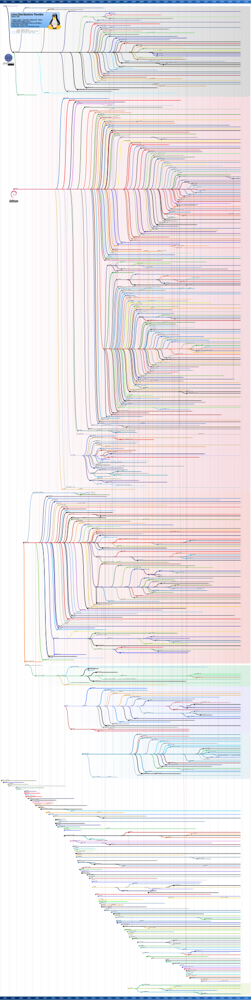

# Linux - Introduction
---
 

Linux is a family of open-source Unix-like operating systems based on the Linux kernel, an operating system kernel first released on September 17, 1991, by <a href="https://en.wikipedia.org/wiki/Linus_Torvalds" target="_blank">Linux Torvalds</a>. 

Popular Linux distributions include Debian, Fedora, and Ubuntu. Commercial distributions include Red Hat Enterprise Linux and SUSE Linux Enterprise Server. Because Linux is freely redistributable, anyone may create a distribution for any purpose. 

Linux is the leading operating system on servers (over 96.4% of the top 1 million web servers' operating systems are Linux), leads other big iron system such as mainframe computers, and is the only OS used on <a href="https://en.wikipedia.org/wiki/TOP500" target="_blank">TOP500</a> supercomputers. 

Linux also runs on embedded systems, i.e. devices whose operating system is typically built into the firmware and is highly tailored to the system. This includes routers, automation controls, smart home technology, televisions (Samsung and LG Smart TVs use Tizen and WebOS respectively), automobiles (for example, Tesla, Audi, Mercedes-Benz, Hyundai and Toyota all rely on Linux), digital video recorders, video game consoles, and smartwatches. 

There are tons of Linux distributions to suit different usecases; ranging from Ubuntu & RedHat releases for the general user to Kali Linux for the White Hat hacker. See below for the outrageous Linux distribution historical timeline. Its amazing what an open source community is capable of.

  

---

## Acknowledgements

- <a href="https://en.wikipedia.org/wiki/Linux" target="_blank">Linux - Wikipedia</a>